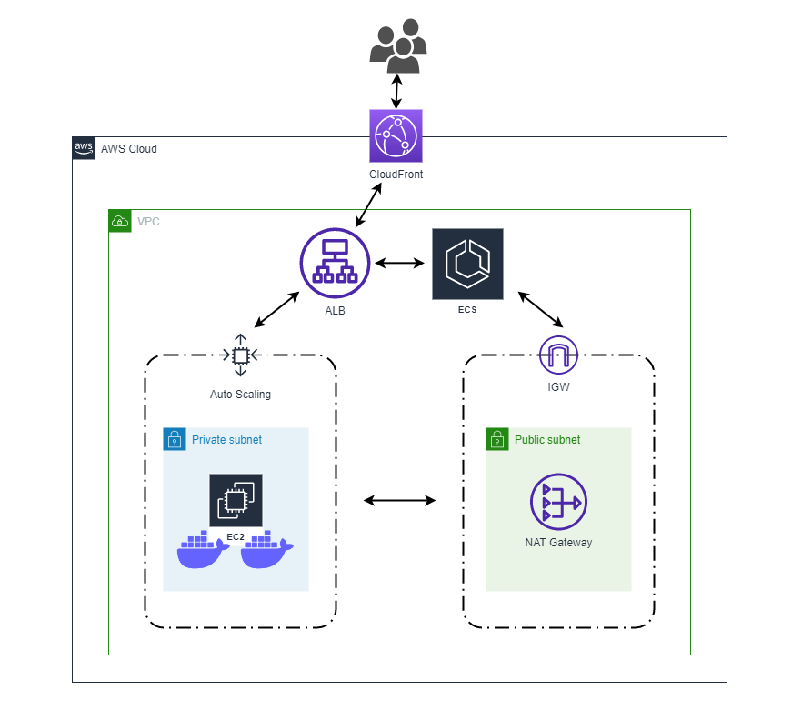

# EWeather infrastructure code
This repository contains infrastructure code that is used for EWeather application  
deployment - https://github.com/torenspb/eweather

Terraform is used to deploy ready-to-use infrastructure on AWS along with deploying  
the latest version of the application itself. Since application is "dockerized",  
AWS ECS cluster with EC2 launch type is used to host the site.  
The infrastructure can be presented as follow:  


Autoscailing group is used to spin-up ECS-optimized EC2 instances which are then  
used by ECS cluster as ECS instances. These instances are deployed in private  
subnets (by default in two separate availability zones).  
NAT gateways are deployed in each public subnet in order for ECS container agent  
to communicate with the Amazon ECS control plane.  
Application load balancer is used to distribute traffic among ECS instances.  
ECS service is used to distribute traffic among tasks (containers) on a single  
ECS instance.  
Cloudfront is configured in order to deliver the website content with low latency  
and high transfer speeds to a larger audience across the globe.  
Only incoming HTTP connections are allowed on ALB for security reasons and EC2  
instances can only receive incoming traffic from ALB.  

# How to deploy
To deploy the infrastructure, make sure AWS access and secret keys for your account  
are configured, then pull this repository, initialize terraform and apply the  
configuration:
```
terraform init
terraform apply
```
Terraform will output an address of the deployed web application in the end:
```
Outputs:

application_address = "http://d28ke587oqqk4b.cloudfront.net/"
```

# Scaling up
This code by default deploys two `t3.micro` EC2 instances and launches 8 ECS   
tasks (containers). 
Following actions can be performed in order to scale the service if application  
starts consuming more resources:
- change EC2 instance type and increase desired amount of tasks
```

```
- increase number of EC2 instances and desired amount of tasks
```

```
- make both previously described changes together

